# Classic Chrome download shelf — observed behavior

Source: a screen recording of Chrome for Testing 113.0.5672.63 driven through 15
scripted scenarios on 2026-05-15 (`~/Videos/2026-05-15 21-54-00.mp4`). Frame
extraction is documented in [../tests/extract.py](../tests/extract.py); the 1 fps
full-resolution frame dump used for this analysis lives in
[../frames/full-21-54-00/](../frames/full-21-54-00/) and the cropped reference
shots are in [screenshots/](screenshots/).

A follow-up recording on 2026-05-16 (`~/Videos/2026-05-16 13-45-32.mp4`) added
a slow manual window-resize segment used to pin down the chip-hiding
thresholds; see [Shelf width and chip-hiding thresholds](#shelf-width-and-chip-hiding-thresholds).

This document is the source of truth for what the DownloadBar extension is
trying to reproduce.

## Anatomy

The shelf is a single horizontal strip at the bottom of every browser window,
~60 px tall, separated from page content by a 1 px divider. Layout, left → right:

1. **Chips** packed from the left, no inter-chip gap, separated by a 1 px
   vertical divider.
2. Optional `Show all` text link.
3. Always-present `×` close button on the far right.

A chip is a flex row: 28 px file-type icon · two-line text block (filename +
status) · 24 px caret button. **Chip width is a fixed 233 image px** in the
captured frames (see [Shelf width and chip-hiding thresholds](#shelf-width-and-chip-hiding-thresholds)
for the analysis). Chips never resize — when the window is too narrow, the
rightmost chip is hidden instead.

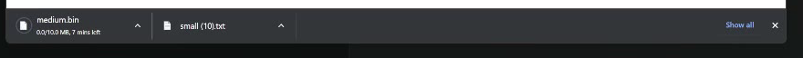

## Chip text by state — verbatim formats

The status line directly under the filename is the entire progress UI; there is
no ring, no inline progress bar, no animation beyond the spinner that may be
shown on the file-type glyph during transfer.

| State | Status line | Reference |
|---|---|---|
| Just initiated | `Starting…` | 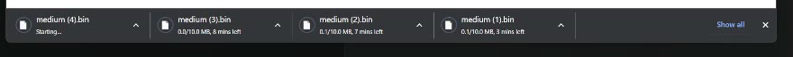 |
| In progress | `0.5/10.0 MB, 5 mins left` | 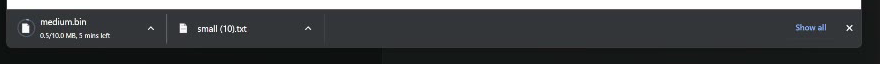 |
| Paused | `0.7/100 MB, Paused` (no ETA) | 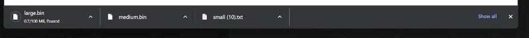 |
| Canceled | `Canceled` | 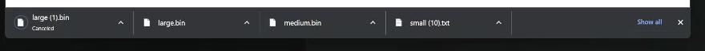 |
| Network failure | `Failed - Network disconnected` | 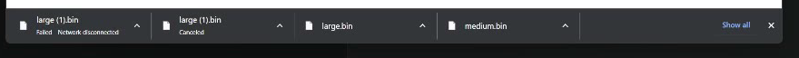 |
| Complete | *(status row empty — only filename)* | 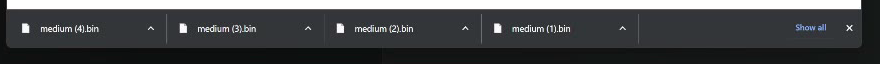 |

Notes on formatting:

- The active-transfer line uses **a single unit suffix** shared by both numbers:
  `0.5/10.0 MB`, not `0.5 MB / 10.0 MB`. Both numbers are rendered with one
  decimal place when below 100 of that unit.
- The ETA reads `N {secs|mins|hrs} left`. While paused, the entire ETA segment
  is replaced with the literal word `Paused` (no remaining-time hint).
- A completed chip drops the status line entirely. The text block becomes a
  single filename, vertically centred in the chip.
- Failures use the human-readable network-stack reason (`Network disconnected`,
  `File no space`, `Server forbidden`, …), prefixed with `Failed - `. We do
  **not** show the raw `INTERRUPT_REASON_*` enum.

## Caret menu

The menu opens **downward** from the caret button, anchored to its right edge.
(Surprising — most Chromium menus go upward — but verified from the capture.)

### Menu while the download is in progress / paused

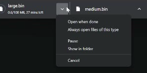

```
Open when done                       ← disabled while transferring
Always open files of this type       ← only enabled for openable mimes
Pause   ⇄   Resume                   ← flips depending on paused state
Show in folder                       ← enabled even before the file exists
─────────────────
Cancel
```

### Menu on a completed chip

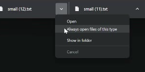

```
Open
Always open files of this type
Show in folder
─────────────────
Cancel                               ← disabled (vestigial)
```

The completed-chip menu keeps a disabled `Cancel` row at the bottom for visual
consistency. We replace it with `Remove from list` because that's the action
the user actually wants there and it disambiguates against the in-progress
`Cancel` (which aborts the transfer).

### Menu on a failed / canceled chip

Verified by inference rather than by direct capture. The legacy shelf showed
`Retry / — / Remove from list` for a `Failed` chip; `USER_CANCELED` shares the
same menu so a cancel is reversible.

## Layout and capacity

- **Newest chip enters on the LEFT**, pushing existing chips to the right. The
  rightmost chip falls off the visible strip first.
- **Hard cap is 4 visible chips.** Starting 10 simultaneous downloads in
  scenario C3 produced only chips for `medium (7..10).bin`; chips 1-6 silently
  disappeared from the shelf with **no "+N more" badge** and no scroll
  affordance. Those downloads kept running and were only accessible via
  `chrome://downloads`.

  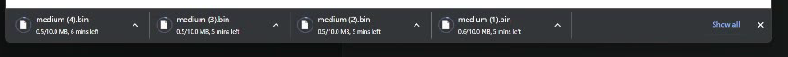

- **`Show all` link visibility is conditional on horizontal space.** It
  appears whenever the shelf has room for it and stays anchored to the right
  edge alongside the close button. On a wide window it is visible even with
  four packed chips (the previous claim that it disappears once packed was
  wrong; see the threshold analysis below). The `×` close button is always
  visible while the shelf is showing.

## Close button (`×`)

Clicking `×` **hides the entire shelf** until a new download arrives. It does
*not* just clear chips — the bar is gone.


In-flight downloads continue in the background and remain visible on
`chrome://downloads`. The next `downloads.onCreated` brings the shelf back with
its previous chips still present.

## Click-to-open

Clicking a completed chip's body (not the caret) opens the file in its default
OS handler and **leaves the chip visually unchanged**. There is no `Opening…`
text, no dim, no auto-removal. Verified by clicking the `small (11).txt` chip
in scenario B1 — the chip stayed identical and Notepad launched off-screen.

## "Always open files of this type" — auto-removes the chip on completion

After toggling the menu item on a `.txt` chip in B2, the next near-instant
`.txt` download in B3 (`small (13).txt`) appeared to never hit the shelf at
all — but that was a side effect of the file completing before the chip
could render. Scenario B4 re-runs the case with the network throttled to
256 kbps and a ~280 KiB `.txt`: an in-progress chip **does** appear and
remains on the shelf for the full transfer, then is silently removed at
completion when Chrome auto-launches the OS default handler. No flash, no
`Opening…` line, no fade — the chip is just gone the instant the download
finishes.

So the bypass is post-completion, not at `onCreated`: the chip exists, gets
normal progress updates, and is removed atomically with the auto-open. An
extension reproduction would need a `complete`-state hook that suppresses
the chip and fires the open, not an `onCreated` short-circuit.

## Drag to desktop

Dragging a completed chip to the desktop **copies** the file (Windows copy
cursor with `+` badge). Since the file is already in `~/Downloads`, Chrome
copies it to the desktop with a `(N)2` collision suffix — e.g.
`small (14).txt` → `small (14)2.txt`. The chip's filename label updates in
place to match the destination copy.

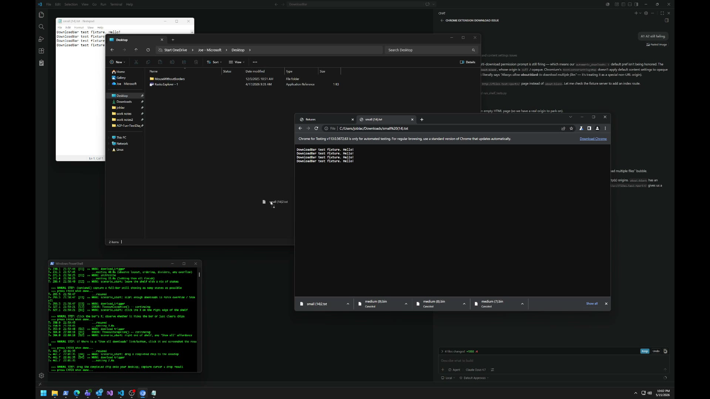

For the extension this is just a `DownloadURL` / `text/uri-list` payload on
`dragstart`. The OS handles the rest.

## `chrome://downloads` parallel UI

For comparison, the full-page downloads view ships its own UI surface that
shares state with the shelf but not chrome:

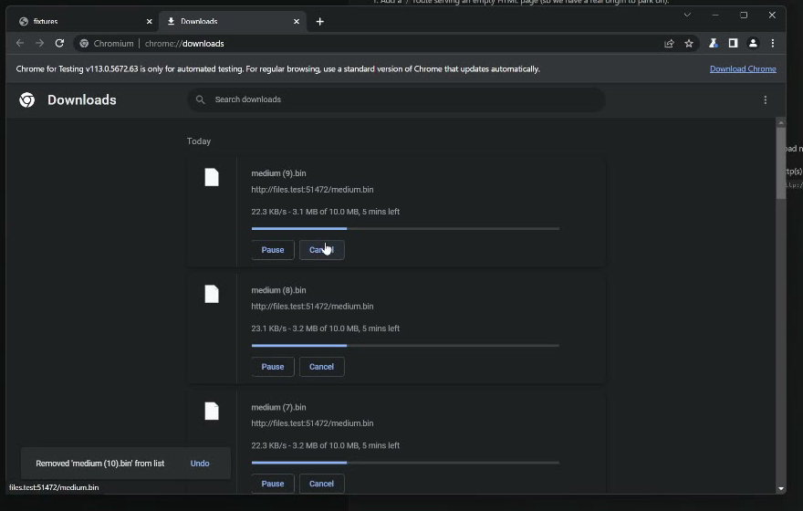

Each entry is a card with:

- File icon, filename, source URL.
- A separate progress bar (the shelf has none).
- A status line in **`X.X KB/s - 3.1 MB of 10.0 MB, 5 mins left`** format — note
  the `MB of MB` wording and the `KB/s` rate prefix, both of which the shelf
  omits.
- Plain `Pause` and `Cancel` text buttons rendered side-by-side (not behind a
  caret menu).
- A page-level toast `Removed '<name>' from list  [Undo]` when an entry is
  removed.

Removing an entry from the downloads page removes it from history but does
**not** cancel an active transfer.

## Per-scenario evidence index

| # | Scenario | Key behavior | Frame |
|---|---|---|---|
| A1 | small.txt instant complete | filename-only chip | t0010 |
| A2 | 10 MB throttled to 256 kbps | `X.X/Y.Y MB, N mins left` text | t0030 |
| A3 | pause/resume via caret menu | `… Paused` status | t0080 |
| A4 | cancel via caret menu | `Canceled` status (neutral grey) | t0118 |
| A5 | offline via CDP | `Failed - Network disconnected` | t0135 |
| A6 | retry from caret | failed chip replaced **in place** | t0170 |
| B1 | click chip body | file opens, chip unchanged | t0180-t0193 |
| B2 | toggle Always-open | menu UX (see screenshot 08) | t0205 |
| B3 | next download of same type | **no chip appears**, file auto-opens | t0215 vs t0220 |
| C1 | 4 simultaneous | shelf packed, `Show all` hidden | t0240 |
| C2 | mixed states | 4 completed chips | t0282 |
| C3 | 10 simultaneous | only newest 4 visible, no overflow indicator | t0290 |
| D1 | click `×` | shelf disappears entirely | t0335 → t0340 |
| D2 | reach `Show all` | opens `chrome://downloads` parallel UI | t0438 |
| D4 | drag to desktop | copy with `(N)2` rename, chip relabels | t0520 |


## Shelf width and chip-hiding thresholds

Derived from the 2026-05-16 recording's C1 scenario, where the window was first
slow-dragged from 1280 → ~900 outer px and back (continuous), then in the E3
scenario stepped through 1000 → 800 → 600 → 460 outer px (discrete settles).
Both produce consistent numbers, so the chip-hiding rule is purely a function
of available shelf width and does not exhibit hysteresis.

### Measured constants

All numbers below are in **CSS px** — the unit Selenium's `set_window_size`
takes and Chromium uses for layout. The chip widget and right-side reserve
are constant in CSS across display zoom; only the outer-window-to-shelf
offset varies slightly with DPR because Chrome's window border rounds to
device pixels.

| Quantity | CSS px | Notes |
|---|---:|---|
| Shelf height | 57 | 57 device px @ DPR=1.0. Visually confirmed via [../tests/height_ladder.html](../tests/height_ladder.html) staircase against a live Chrome 113 shelf. The earlier figure of 38 CSS in this table came from [../tests/measure_2026_05_16.py](../tests/measure_2026_05_16.py), which assumed the 4K capture was DPR=1.5; the recording was actually on a native 3840×2400 panel at DPR=1.0, so 57 device px is 57 CSS, not 38. |
| Chip width | 233 | Fixed; never resizes when the window shrinks. |
| Right-side reserve (Show all + close × + padding) | 121 | Pixel-confirmed at both DPR=1.0 and DPR=1.5. |
| Outer-window to shelf-inner offset | 14 (DPR=1.0), 12 (DPR=1.5) | Shrinks slightly at higher DPR. |

### Current theory

Chips have a fixed CSS-px width; the rightmost chip is dropped whenever the
shelf cannot fit all of them alongside the right-side controls. The exact
thresholds (pixel-confirmed by 1-px Selenium toggle at both DPR=1.0 and
DPR=1.5) are:

> `shelf_w_min(N) = N × 233 + 121 CSS px`  
> `outer_w_min(N) = N × 233 + 121 + offset_css`  
> where offset_css = 14 @ DPR=1.0, 12 @ DPR=1.5

| N visible chips | Min shelf width (CSS) | Min outer width @ DPR=1.0 | Min outer width @ DPR=1.5 |
|---:|---:|---:|---:|
| 4 | 1053 | 1067 ✓ | 1065 ✓ |
| 3 |  820 |  834 ✓ |  832 ✓ |
| 2 |  587 |  601 ✓ |  599 ✓ |
| 1 |  354 |  368 (clamped) | 366 (clamped) |

Each boundary was confirmed to the pixel by [../tests/visual_resize_demo.py](../tests/visual_resize_demo.py),
which toggles `set_window_size` between `outer = T` and `outer = T − 1` three
times at each predicted threshold. The chip pops in/out on every toggle at
both display scales.

Chrome enforces a minimum outer window width of ~516 CSS px on this build,
so the 1 → 0 transition is not observable by resizing.

Chrome enforces a minimum outer window width of ~516 px on this build, so
once the requested width drops below that the shelf cannot shrink further;
the bottom-side `1 → 0` transition is therefore not observable by resizing.

### Selenium probe results

[../tests/test_resize_breakpoints.py](../tests/test_resize_breakpoints.py)
sets the window to widths that land just above and just below each predicted
threshold, screenshots the desktop, and counts chips. With four heavily
throttled in-flight downloads, **8/8 probes match the prediction**:

| Threshold | set just-above | expected | got | set just-below | expected | got |
|---|---:|---:|---:|---:|---:|---:|
| 4 → 3 | 1071 | 4 | 4 | 1055 | 3 | 3 |
| 3 → 2 |  838 | 3 | 3 |  822 | 2 | 2 |
| 2 → 1 |  605 | 2 | 2 |  589 | 1 | 1 |
| 1 → 0 |  372 | 1 | 1 |  356 | 1 (clamped) | 1 |
